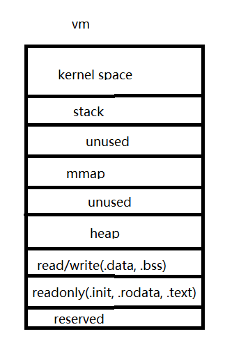

### 内存池原理与实现

#### 1.为什么要有内存池？

> 用户能够管理的虚拟内存只有heap和mmap，
> 
> 内存池是对堆上的内存进行管理。
> 
> 那么，堆上的内存为什么需要用户管理呢？
> 
> 1.为了防止和避免“内存碎片”的产生；
> 
> 2.为了避免频繁的申请/释放内存；

内存池 tcmalloc/jemalloc

#### 2.内存管理

> 分配的大小是不确定的
> 什么时候分配什么时候释放是不确定的

那么该如何设计内存池呢？
用户申请 <= 1k 内存时，

(1)每次分配给用户固定大小内存 1k，这样可以避免内存碎片问题，但是大量内存是没有使用的。

(2)每次按 2^n 分配给用户，比如用户需要 15B，那么就分配给用户 16B，但是这种方式在回收时，内存之间不在是连续的。

